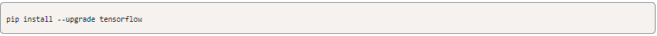
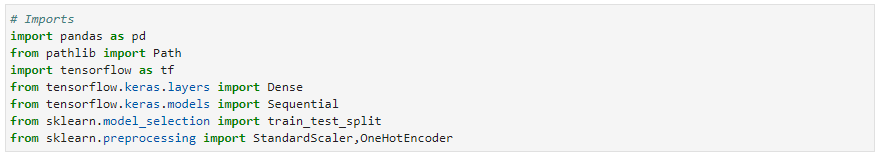

# Neural_Networks

___
For this project, I will take on the role of a Risk Management Associate at the fictional venture capital, Alphabet Soup. I will predict whether Alphabet Soup funding applicants will be successful, by creating a binary classification model using a deep neural network. This requires the following:

* Preprocessing data for a neural network model.
* Using the model-fit-predict pattern to compile and evaluating a binary classification model.
* Optimizing the model.

---

## Technologies

This project leverages python 3.7 with various Libraries and IDE:

* [Imbalanced Learn](https://pypi.org/project/imbalanced-learn/) - a python package offering a number of re-sampling techniques commonly used in datasets showing strong imbalance between classes.
* [TensorFlow](https://www.tensorflow.org/) - a Machine Learning platform.
* [Keras](https://keras.io/about/) - a deep learning API written on the TensorFlow platform.

---

## Installation Guide

In order to run the application, one should install the following:

* Install Imbalanced-Learn

* Install TensorFlow

---

## Usage
To use the analysis, clone the repository and run the venture_funding_with_deep_learning.ipynb file.

---

## Contributors

Franco Thomas - francothomas1989@gmail.com

---

## License

MIT